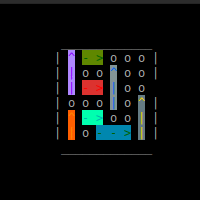

# Rush Hour Game

Classic rush hour game to free the read car from the parking lot.

# Screen Shot

# TODO

- [ ] [Feature] Update main to let you choose a game and render the solution
- [ ] [Doc] Update Readme with explanation and gif of main work-flow
- [ ] [Refactor] remove color indirection 
- [ ] [Refactor] unify Move and direction
- [ ] [Refactor] make a "Move" abstraction that describes both direction and car

